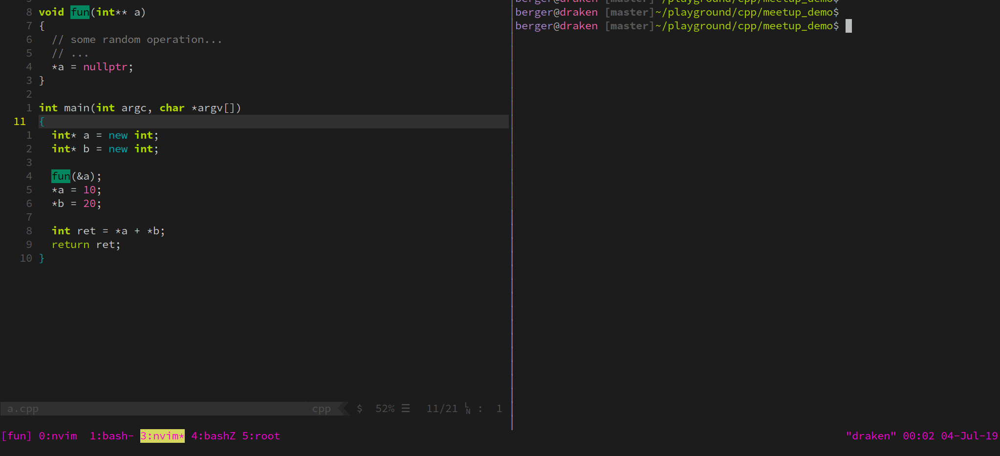
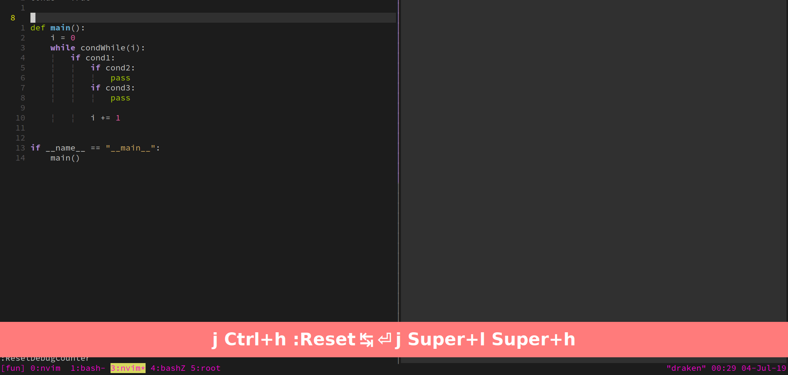
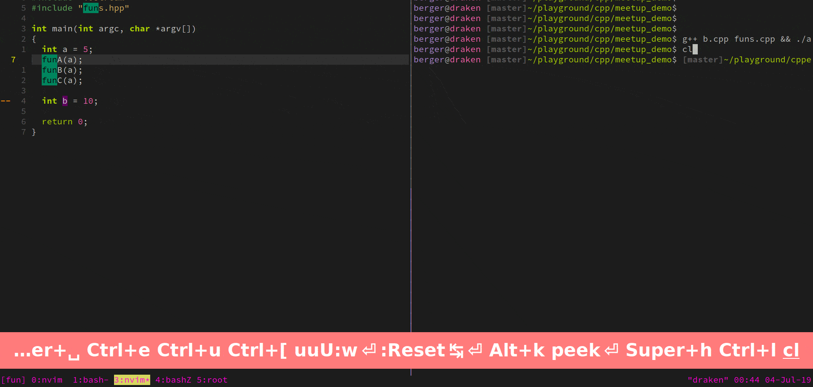

<!-- .slide: class="center" -->
## ``vim-debugstring``

#### Debug printf()-style at the speed of light

Nikos Koukis 

---

## Purpose/Features

<ul>
<li>Easy way to do `printf`-style debugging to check code control flow,
inspect variables/expressions</li> 
<li>No need to use ``gdb`` / compile in debug</li>
<li>Language-agnostic (uses ``echo`` when debugging in Bash, ``std::cout`` in C++ and ``print()`` in Python)</li>
<li>Integrates with ``vim-repeat`` i.e,,Use keybinding once, use ``.`` to repeat.</li>
</ul>

---

## Usecases

---

### Find segfault location

---

### Inspect the code control flow:

---

### Inspect variable/expression value

---

## Links

- vim.org: https://vim.sourceforge.io/scripts/script.php?script_id=5634
- Github: https://github.com/bergercookie/vim-debugstring
- Presentation at VIM London: TODO
